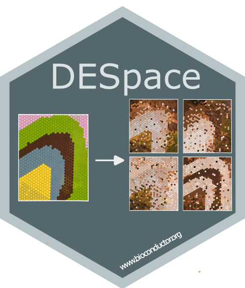

# DESpace: a framework to discover spatially variable genes and differential spatial patterns across conditions



`DESpace` is a framework for identifying spatially variable genes (SVGs), a common task in spatial transcriptomics analyses, and differential spatial variable pattern (DSP) genes, which identify differences in spatial gene expression patterns across experimental conditions.

By leveraging pre-annotated spatial clusters as summarized spatial information, `DESpace` models gene expression with a negative binomial (NB), via [edgeR](https://bioconductor.org/packages/release/bioc/html/edgeR.html), with spatial clusters as covariates. SV genes are then identified by testing the significance of spatial clusters. For detailed guidance on detecting SVGs with *DESpace*, refer to [*SVGs vignettes*](https://www.bioconductor.org/packages/release/bioc/vignettes/DESpace/inst/doc/DESpace.html).

For multi-sample, multi-condition datasets, again we fit a NB model via [edgeR](https://bioconductor.org/packages/release/bioc/html/edgeR.html), but this time we use spatial clusters, conditions and their interactions as covariates.
DSP genes are then identified by testing the interaction between spatial clusters and conditions.

Check the vignettes for a description of the main conceptual and mathematical aspects, as well as usage guidelines.

> Peiying Cai, Mark D. Robinson, and Simone Tiberi (2024).
>
> DESpace: spatially variable gene detection via differential expression testing of spatial clusters.
>
> Bioinformatics.
> Available [here](https://doi.org/10.1093/bioinformatics/btae027)

## Bioconductor installation 
`DESpace` is available on [Bioconductor](https://bioconductor.org/packages/DESpace) and can be installed with the command:
``` r
if (!requireNamespace("BiocManager", quietly=TRUE))
    install.packages("BiocManager")
BiocManager::install("DESpace")
```

## Vignette
The vignette illustrating how to use the package can be accessed on 
[Bioconductor](https://bioconductor.org/packages/DESpace)
or from R via:
``` r
vignette("DESpace")
```
or
``` r
browseVignettes("DESpace")
```
