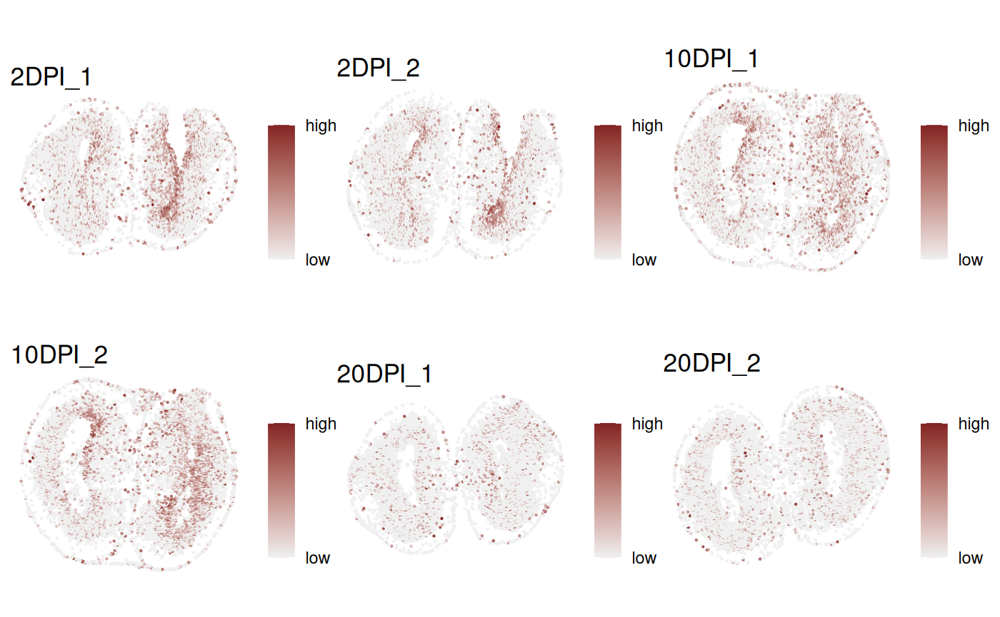
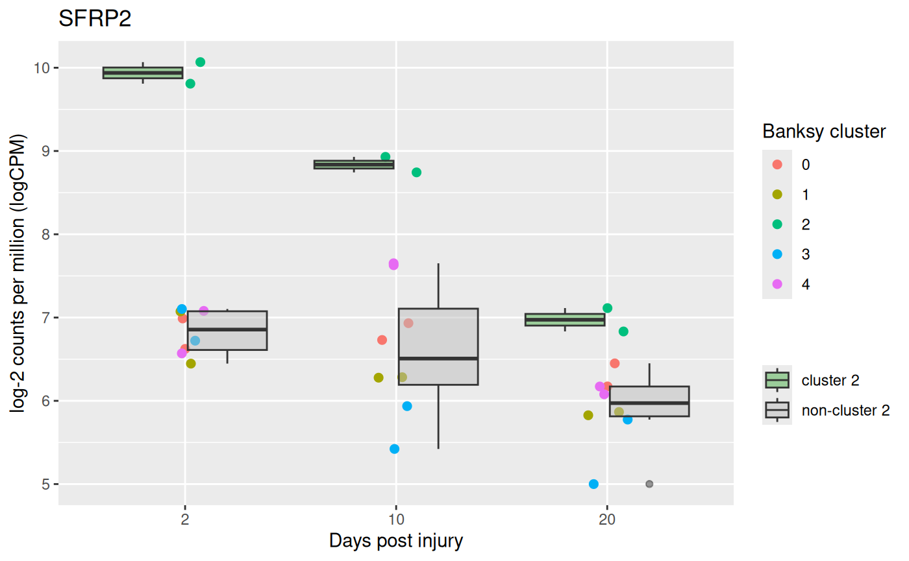
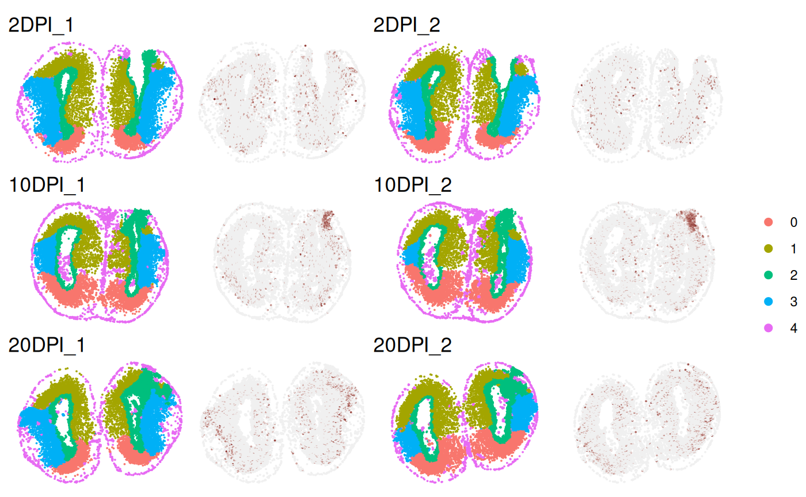

# Differential Spatial Pattern between conditions

------------------------------------------------------------------------

## Introduction

*DESpace* is a framework for identifying spatially variable genes
(SVGs), a common task in spatial transcriptomics analyses, and
differential spatial variable pattern (DSP) genes, which identify
differences in spatial gene expression patterns across experimental
conditions.

By leveraging pre-annotated spatial clusters as summarized spatial
information, *DESpace* models gene expression with a negative binomial
(NB), via *edgeR* (Robinson, McCarthy, and Smyth 2010), with spatial
clusters as covariates. SV genes are then identified by testing the
significance of spatial clusters. For detailed guidance on detecting
SVGs with *DESpace*, refer to [*SVGs
vignettes*](https://www.bioconductor.org/packages/release/bioc/vignettes/DESpace/inst/doc/DESpace.html).

For multi-sample, multi-condition datasets, again we fit a NB model via
*edgeR* (Robinson, McCarthy, and Smyth 2010), but this time we use
spatial clusters, conditions and their interactions as covariates. DSP
genes are then identified by testing the interaction between spatial
clusters and conditions. Notably, this framework can identify
differences also between more than 2 groups. This vignette will
demonstrate how to perform DSP analyses.

## Load packages

``` r
suppressMessages({
    library(DESpace)
    library(ggplot2)
    library(SpatialExperiment)
    library(muSpaData)
    library(reshape2)
    library(tidyverse)
    library(patchwork)
    library(splines)
    library(edgeR)
})
set.seed(123)
```

## Data

As an example dataset, we consider a multi-sample, multi-group spatially
resolved transcriptomics data - the Stereo-seq dataset of taxolotl
telencephalon brain regeneration stages (Wei et al. 2022). The dataset
includes axolotl brain tissues collected at various days post-injury
(DPI): 2 (3 sections), 5 (3 sections), 10 (3 sections), 15 (4 sections),
20 (3 sections), 30 (1 section) and 60 (1 section), after the removal of
a reproducible portion of dorsal pallium in left telencephalic
hemisphere of axolotl. The original dataset is available for download
via [*STOmicsDB*](https://db.cngb.org/stomics/artista/download/), and
the processed dataset (including spatial clusters) can be accessed via
[*muSpaData*](https://github.com/peicai/muSpaData) ExperimentHub
package.

### Input data

Here, we use a subset of the original data, consisting of three distinct
regeneration stages: 2, 10 and 20 DPI, with two sections for each stage.

``` r
# Load the small example data
spe <- Wei22_example()
# The following columns from colData(spe) are specified:
coordinates <- c("sdimx", "sdimy") # coordinates of cells
spatial_cluster <- 'Banksy_smooth' # Banksy spatial clusters
condition_col <- 'condition'       # regeneration time phases
sample_col <- 'sample_id'          # tissue section id
colData(spe) |> head()
```

    ## DataFrame with 6 rows and 5 columns
    ##                    sample_id condition Banksy_smooth     sdimx     sdimy
    ##                     <factor>  <factor>      <factor> <numeric> <numeric>
    ## CELL.17879.10DPI_1   10DPI_1     10DPI             4         1      2406
    ## CELL.17922.10DPI_1   10DPI_1     10DPI             4        10      2372
    ## CELL.17966.10DPI_1   10DPI_1     10DPI             4        29      3090
    ## CELL.17976.10DPI_1   10DPI_1     10DPI             4        33      3139
    ## CELL.17987.10DPI_1   10DPI_1     10DPI             4        33      2267
    ## CELL.17988.10DPI_1   10DPI_1     10DPI             4        37      2791

The spatial tissues of each sample were annotated via Banksy (Singhal et
al. 2024), classifying cells into five clusters. These cluster
annotations are stored in the `Banksy_smooth` column of colData.
Additionally, the columns `sdimx` and `sdimy` contain the spatial
coordinates of the cells, while the `condition` column specifies the
group (i.e., stage) each cell belongs to.

### Quality control/filtering

Quality control (QC) procedures at the cell and gene level aim to remove
both low-quality cells, and lowly abundant genes. For QC, we adhere to
the instructions from “Orchestrating Spatially Resolved Transcriptomics
Analysis with Bioconductor”
([*OSTA*](https://lmweber.org/OSTA-book/quality-control.html)). Library
size and UMI counts are used to identify low-quality cells. Then, we
discard lowly abundant genes that are detected in fewer than 20 cells. R
scripts for performing quality control on this example dataset can be
found in [*muSpaData R
scripts*](https://github.com/peicai/muSpaData/blob/main/inst/scripts/make-data.R#L94-L130).

### Clustering

This framework relies on spatial clusters being accessible and
successfully summarizing the primary spatial characteristics of the
data. In most datasets, these spatial features are either accessible or
can be generated with spatial clustering algorithms.

#### Manual annotation

If the manual annotation (e.g., annotated by a pathologist) for each
sample is available, we can combine all samples and use manual
annotations directly. Note that cluster labels must be consistent across
samples (i.e., cluster 1 in sample 1 should represent the same tissue as
cluster 1 in sample 2).

#### Spatially resolved (multi-sample) clustering

If manual annotations are not available, we can use spatially resolved
clustering tools. These methods, by jointly employing spatial
coordinates and gene expression data, enable obtaining spatial clusters.

Among others, BayesSpace (Zhao et al. 2021) and Banksy (Singhal et al.
2024) allow jointly clustering multiple samples. In particular each tool
has a specific vignettes for multi-sample clustering: [*BayesSpace
vignettes*](https://edward130603.github.io/BayesSpace/articles/joint_clustering.html),
and [*Banksy
vignettes*](https://prabhakarlab.github.io/Banksy/articles/multi-sample.html).

Details on applying Banksy joint clustering to this example dataset can
also be found in [*muSpaData R
scripts*](https://github.com/peicai/muSpaData/blob/main/inst/scripts/make-data.R#L131-L230).

``` r
# View Banksy clusters 
# The spatial cluster assignments are available in the `colData(spe)`
CD <- colData(spe) |> as.data.frame()
ggplot(CD, aes(x = sdimx, y = sdimy, color = factor(Banksy_smooth))) +
    geom_point(size = 0.25) +
    facet_wrap(~sample_id, scales = 'free') +
    theme_void() +
    theme(legend.position = "bottom") +
    guides(color = guide_legend(override.aes = list(size = 3))) +
    labs(color = NULL, title = "Banksy Spatial Clusters")
```


##### Single sample clustering

In our benchmarks, we have noticed that, with both *BayesSpace* and
*Banksy*, joint spatial clustering of multiple samples does not always
yield more accurate results than spatial clustering of individual
samples. Therefore, if multi-sample clustering fails, we suggest
clustering individual samples (as described in Section 3 *Individual
sample* in the [*SVG
Vignette*](https://www.bioconductor.org/packages/release/bioc/vignettes/DESpace/inst/doc/DESpace.html))
and manually matching cluster ids across samples, to ensure that
“cluster 1” always refers to the same spatial region in all samples.

## DSP testing

Once we have spatial clusters, we can search for DSP between conditions.
Importantly, only clusters identified in all samples will be analyzed.

### Gene-level test

Fit the model via `dsp_test` function. Parameter `spe` specifies the
input `SpatialExperiment` or `SingleCellExperiment` object, while
`cluster_col`, `sample_col` and `condition_col` indicate the
corresponding column names in `colData(spe)` for spatial clusters,
sample ids, and condition labels.

The `test` argument determines whether to use quasi-likelihood F-tests
(`test = "QLF"`) or likelihood ratio tests (`test = "LRT"`). QLF
provides stronger error control by modeling dispersion uncertainty,
whereas LRT is generally more sensitive. In this example, we use the
default setting, `test = QLF`. Set `verbose = TRUE` (default) to view
detailed statistics.

``` r
results <- dsp_test(spe = spe,
                    cluster_col = spatial_cluster,
                    sample_col = sample_col,
                    condition_col = condition_col,
                    test = 'QLF',
                    verbose = TRUE)
```

    ## Using 'dsp_test' for spatial variable pattern genes detection.

    ## Filter low quality clusters:

    ## Cluster levels to keep: 0, 1, 2, 3, 4

    ## Design model: row names represent sample names, followed by underscores and cluster names.

    ##          (Intercept) condition20DPI condition2DPI cluster_id1 cluster_id2
    ## 2DPI_1_0           1              0             1           0           0
    ## 2DPI_2_0           1              0             1           0           0
    ##          cluster_id3 cluster_id4 condition20DPI:cluster_id1
    ## 2DPI_1_0           0           0                          0
    ## 2DPI_2_0           0           0                          0
    ##          condition2DPI:cluster_id1 condition20DPI:cluster_id2
    ## 2DPI_1_0                         0                          0
    ## 2DPI_2_0                         0                          0
    ##          condition2DPI:cluster_id2 condition20DPI:cluster_id3
    ## 2DPI_1_0                         0                          0
    ## 2DPI_2_0                         0                          0
    ##          condition2DPI:cluster_id3 condition20DPI:cluster_id4
    ## 2DPI_1_0                         0                          0
    ## 2DPI_2_0                         0                          0
    ##          condition2DPI:cluster_id4
    ## 2DPI_1_0                         0
    ## 2DPI_2_0                         0

A list of results is returned, with the main results of interest stored
in the `gene_results` data frame. This frame contains several columns,
including gene names (`gene_id`), log2-fold changes between groups (e.g,
`logFC.condition2DPI.cluster_id1`), average (across cells) log-2 counts
per million (`logCPM`), likelihood ratio test statistics (`LR`), raw
p-values (`PValue`) and Benjamini-Hochberg adjusted p-values (`FDR`).

Specifically, the column `logFC.condition2DPI.cluster_id1` represents
the difference in the log2-fold change of gene expression under **2
DPI** in **cluster 1** relative to the baseline condition (**10 DPI**)
and baseline cluster (**cluster 0**).

In other words, we are testing whether the spatial structure of gene
expression (summarized by the clusters) differs between 2 and 10 DPI.

``` r
head(results$gene_results, 2)
```

    ##                       gene_id logFC.condition20DPI.cluster_id1
    ## AMEX60DD014721 AMEX60DD014721                      -0.06833567
    ## AMEX60DD045083 AMEX60DD045083                       0.09389617
    ##                logFC.condition2DPI.cluster_id1 logFC.condition20DPI.cluster_id2
    ## AMEX60DD014721                      -0.3889827                       -0.8473123
    ## AMEX60DD045083                       0.5489107                       -1.3304455
    ##                logFC.condition2DPI.cluster_id2 logFC.condition20DPI.cluster_id3
    ## AMEX60DD014721                       0.8520273                       -0.8295217
    ## AMEX60DD045083                       1.1215511                        0.2403202
    ##                logFC.condition2DPI.cluster_id3 logFC.condition20DPI.cluster_id4
    ## AMEX60DD014721                      -0.9450144                        0.2258349
    ## AMEX60DD045083                       1.2768794                       -0.9889594
    ##                logFC.condition2DPI.cluster_id4   logCPM        F       PValue
    ## AMEX60DD014721                       0.2097897 9.344907 17.14731 1.401391e-08
    ## AMEX60DD045083                      -0.8093096 7.505402 13.65550 1.458452e-07
    ##                         FDR
    ## AMEX60DD014721 7.006953e-05
    ## AMEX60DD045083 3.646131e-04

The second element of the results (a `DGEList` object `estimated_y`)
contains the estimated common dispersion.

The third and fourth element of the results (`DGEGLM` and `DGELRT`
objects) contain the underlying statistics returned by the chosen
testing framework. For `test = "QLF"`, these are `glmQLFit` and
`glmQLFTest`; for `test = "LRT`, they are `glmFit` and `glmLRT`.

``` r
class(results$estimated_y)
```

    ## [1] "DGEList"
    ## attr(,"package")
    ## [1] "edgeR"

``` r
class(results$glmQLFit)    # or results$glmFit  depending on test
```

    ## [1] "DGEGLM"
    ## attr(,"package")
    ## [1] "edgeR"

``` r
class(results$glmQLFTest)  # or results$glmLRT  depending on test
```

    ## [1] "DGELRT"
    ## attr(,"package")
    ## [1] "edgeR"

Visualize the gene expression of the most significant genes with
[`FeaturePlot()`](https://peicai.github.io/DESpace/reference/FeaturePlot.md).
Note that the gene names in vector `feature`, should also appear in the
count matrix’s row names. Specifying the column names of spatial
coordinates of spots is only necessary when they are not named `row` and
`col`.

``` r
sample_ids <- levels(CD$sample_id)

# Identify the top DSP
(feature <- results$gene_results$gene_id[1])
```

    ## [1] "AMEX60DD014721"

``` r
# Extract the gene_name by matching the gene_id
(feature_name <- rowData(spe)$gene_id[
  rowData(spe)$gene_name %in% feature
])
```

    ## [1] "ECM1"

``` r
# generate a list of plots
plots <- lapply(sample_ids, function(sample_id) {
  
  # Subset spe for each sample
  spe_j <- spe[, colData(spe)$sample_id == sample_id]
  
  # Create FeaturePlot for the sample
  plot <- FeaturePlot(spe_j, feature,
                      coordinates = coordinates,
                      platform = "Stereo-seq", ncol = 1,
                      diverging = TRUE,
                      point_size = 0.1, legend_exprs = TRUE) + 
    theme(legend.position = "right",
          legend.key.size = unit(0.5, 'cm')) +
    labs(color = "") + ggtitle(sample_id) 
  
  return(plot)
})
```

The spatial structure of gene expression changes across conditions,
transitioning from more localized patterns at earlier stages (2 and 10
DPI) to a broader distribution at a later stage (20 DPI).

``` r
combined_plot <- wrap_plots(plots, ncol = 3) + 
    # common legend
    plot_layout(guides = 'collect')  
combined_plot
```



### Individual cluster test

*DESpace* can also be used to reveal the specific areas of the tissue
affected by spatial variability; i.e., spatial clusters that are
particularly over/under abundant compared to the average across
conditions. Function
[`individual_dsp()`](https://peicai.github.io/DESpace/reference/individual_dsp.md)
can be used to identify DSP genes for each individual cluster.
Parameters `cluster_col`, `sample_col` and `condition_col` indicate the
column names in `colData(spe)` for spatial clusters, sample ids, and
condition ids, respectively.

``` r
cluster_results <- individual_dsp(spe,
                                  cluster_col = spatial_cluster,
                                  sample_col = sample_col,
                                  condition_col = condition_col)
```

[`individual_dsp()`](https://peicai.github.io/DESpace/reference/individual_dsp.md)
returns a list containing the results of the individual cluster tests.
Similarly to above, the results for each cluster are presented as a
`data.fame`, where columns contain gene names (`gene_id`), likelihood
ratio test statistics (`LR`), log2-fold changes (`logFC`), raw p-values
(`PValue`) and Benjamini-Hochberg adjusted p-values (`FDR`).

Here, we present the top results for cluster 2.
`logFC.condition20DPI.cluster_id2` represents the interaction between
the 20 DPI condition and cluster 2. It compares the effect of 20 DPI in
cluster 2 with its effect in all other clusters (i.e., all tissue
regions excluding cluster 2, which serves as the baseline). A positive
log-fold change value suggests that, the increase in gene expression in
**cluster 2** from 10 DPI (the baseline) to 20 DPI is **greater** than
the increase in gene expression in **all other clusters** from 10 DPI to
20 DPI.

``` r
class(cluster_results)
```

    ## [1] "list"

``` r
names(cluster_results)
```

    ## [1] "0" "1" "2" "3" "4"

``` r
cluster_results$`2` |> head(n = 4)
```

    ##                       gene_id logFC.condition20DPI.cluster_id2
    ## AMEX60DD014721 AMEX60DD014721                       -0.5804007
    ## AMEX60DD045083 AMEX60DD045083                       -1.0629587
    ## AMEX60DD055246 AMEX60DD055246                       -0.2621394
    ## AMEX60DD014991 AMEX60DD014991                        2.7065895
    ##                logFC.condition2DPI.cluster_id2   logCPM        F       PValue
    ## AMEX60DD014721                       1.2700217 9.582333 79.74974 7.282047e-08
    ## AMEX60DD045083                       0.9054036 8.266790 40.96951 3.136418e-06
    ## AMEX60DD055246                      -2.2986562 5.661946 37.18572 5.300901e-06
    ## AMEX60DD014991                       3.0257108 7.330327 36.55611 5.813224e-06
    ##                         FDR
    ## AMEX60DD014721 0.0003641023
    ## AMEX60DD045083 0.0072665306
    ## AMEX60DD055246 0.0072665306
    ## AMEX60DD014991 0.0072665306

Visualize the gene expression of the top gene for cluster 2.

``` r
# one of top DSPs for cluster 2
(feature <- rownames(cluster_results[["2"]])[4])
```

    ## [1] "AMEX60DD014991"

``` r
# Extract the gene_name by matching the gene_id
(feature_name <- rowData(spe)$gene_id[
  rowData(spe)$gene_name == feature
])
```

    ## [1] "LOC108699649[nr]"

#### Visualization

##### Abundance trend

One way is to plot the overall abundance of LOC108699649\[nr\] for each
cluster-sample combination. Under the null hypothesis, gene expression
changes across conditions are consistent across clusters.

The boxplots below show the average log-CPM for cluster 2 and for all
other clusters (excluding cluster 2) across different stages. In Cluster
2, the average abundance is highest at 2 DPI, then decreases at 10 DPI
and continues to drop at 20 DPI. In contrast, although there is a slight
decrease in abundance across other clusters, it remains relatively
constant overall.

Code

``` r
# calculate log cpm
cps <- cpm(results$estimated_y, log = TRUE)
cps_name <- colnames(cps)
mdata <- data.frame(
    log_cpm = cps[feature, ] ,
    Banksy_smooth = factor(sub(".*_", "", cps_name)),
    day = as.numeric(sub("([0-9]+)DPI.*", "\\1", cps_name)),
    sample_id = sub("(_[0-9]+)$", "", cps_name)
)
plt <- ggplot(mdata, aes(x = factor(day), y = log_cpm)) +
    geom_jitter(aes(color = Banksy_smooth), size = 2, width = 0.1) + 
    geom_boxplot(aes(fill = ifelse(Banksy_smooth == "2", 
                                   "cluster 2", "non-cluster 2")), 
                 position = position_dodge(width = 0.8), alpha = 0.5) +
    scale_x_discrete(breaks = c(2, 10, 20)) +  
    scale_fill_manual(values = c("#4DAF4A", "grey")) + 
    labs(title = feature_name, x = "Days post injury", 
         y = "log-2 counts per million (logCPM)", fill = "",
         color = "Banksy cluster") +
     theme(legend.position = "right")
```

``` r
# figure
plt
```



##### Spatial expression

Alternatively, gene expression can be visualized in physical space with
[`FeaturePlot()`](https://peicai.github.io/DESpace/reference/FeaturePlot.md).
A cluster outline drawn by specifying the column names of clusters
stored in `colData(spe)` and the vector of cluster names via
`cluster_col` and `cluster`.

Code

``` r
# generate a list of FeaturePlots
plots <- lapply(sample_ids, function(sample_id) {
    # Subset spe for each sample
    spe_j <- spe[, colData(spe)$sample_id == sample_id]
    # Create FeaturePlot for the sample
    plot <- FeaturePlot(spe_j, feature, 
                        cluster_col = spatial_cluster,
                        coordinates = coordinates, cluster = '2',
                        platform = "Stereo-seq",
                        diverging = TRUE,
                        point_size = 0.1,
                        linewidth = 0.6) +
        theme(legend.position = "right",
              legend.key.size = unit(0.5, 'cm')) +
        labs(color = "") + ggtitle(sample_id) 
  
    return(plot)
})
combined_plot <- wrap_plots(plots, ncol = 3) + 
    # common legend
    plot_layout(guides = 'collect')  
```

Again, the spatial structure of gene expression varies across groups; in
particular, at 2 and 10 DPI, abundance is higher in cluster 2 (outlined
in the plot), compared to the rest of the tissue, while at 20 DPI
abundance is more homogeneous.

``` r
# figure
combined_plot 
```


### Smooth splines to model time

*DESpace* offers a flexible framework that allows users to create a
custom design matrix. The default design matrix is
`model.matrix(~ condition * cluster)`. Below, we provide an example of
how to create a design matrix using piecewise-cubic splines to account
for the effect of time.

First, we create metadata associated with the samples and clusters. For
each cluster level, there are 3 time phases (i.e., `day`) and 2
replicates (i.e., \`rep\`\`) for each time point.

``` r
# all combinations of sample and cluster
metadata <- expand.grid(sample_id = levels(spe$sample_id),
                        cluster = levels(spe$Banksy_smooth)
                        ) |>
    # extract time point as 'day' from sample_id 
    mutate(
      day = as.numeric(sub("DPI.*", "", sample_id)),
      rep = as.numeric(sub(".*_", "", sample_id)) 
      )
metadata |> head(n = 3)
```

    ##   sample_id cluster day rep
    ## 1    2DPI_1       0   2   1
    ## 2    2DPI_2       0   2   2
    ## 3   10DPI_1       0  10   1

Instead of treating time phases (e.g., 2 DPI, 10 DPI, 20 DPI) as a
categorical variable, we can model the time trend using a smooth spline
function. This can be achieved with the `ns(x, df)` function from the
[*splines*](https://stat.ethz.ch/R-manual/R-devel/library/splines/html/ns.html)
package. Here, `x` represents the predictor variable—time phases (`day`
in the `metadata`) in our case-and `df` specifies the degrees of
freedom, which determine the total number of parameters in the
[`ns()`](https://rdrr.io/r/splines/ns.html) time model, including the
intercept.

``` r
design_model <- model.matrix(~ cluster * ns(day, df = 2), 
                             data = metadata)
rownames(design_model) <- paste0(metadata$sample_id, "_",
                                 metadata$cluster)
dim(design_model)
```

    ## [1] 30 15

``` r
design_model |> head(n = 3)
```

    ##           (Intercept) cluster1 cluster2 cluster3 cluster4 ns(day, df = 2)1
    ## 2DPI_1_0            1        0        0        0        0        0.0000000
    ## 2DPI_2_0            1        0        0        0        0        0.0000000
    ## 10DPI_1_0           1        0        0        0        0        0.5513298
    ##           ns(day, df = 2)2 cluster1:ns(day, df = 2)1 cluster2:ns(day, df = 2)1
    ## 2DPI_1_0         0.0000000                         0                         0
    ## 2DPI_2_0         0.0000000                         0                         0
    ## 10DPI_1_0       -0.2274421                         0                         0
    ##           cluster3:ns(day, df = 2)1 cluster4:ns(day, df = 2)1
    ## 2DPI_1_0                          0                         0
    ## 2DPI_2_0                          0                         0
    ## 10DPI_1_0                         0                         0
    ##           cluster1:ns(day, df = 2)2 cluster2:ns(day, df = 2)2
    ## 2DPI_1_0                          0                         0
    ## 2DPI_2_0                          0                         0
    ## 10DPI_1_0                         0                         0
    ##           cluster3:ns(day, df = 2)2 cluster4:ns(day, df = 2)2
    ## 2DPI_1_0                          0                         0
    ## 2DPI_2_0                          0                         0
    ## 10DPI_1_0                         0                         0

Fit the model via `dsp_test` function.

``` r
results <- dsp_test(spe,
                    design = design_model,
                    cluster_col = spatial_cluster,
                    sample_col = sample_col,
                    condition_col = condition_col,
                    verbose = TRUE)
```

``` r
# count significant DSP genes (at 5% FDR significance level)
res_global <- results$gene_results
table(res_global$FDR <= 0.05)
```

    ## 
    ## FALSE  TRUE 
    ##  4943    57

To identify key spatial clusters where expression changes across
conditions, we apply the smooth spline with a single-cluster design.
Specifically, we convert the original Banksy clusters into two groups:
the target cluster and all other clusters. We then apply the same test
as in the global test above.

``` r
# example: testing for cluster 2
# convert 5 Banksy clusters into 2 groups: cluster 2 vs. all other clusters
new_cluster <- factor(ifelse(spe$Banksy_smooth %in% '2', '2', 'Other'))
metadata2 <- expand.grid(sample_id = levels(spe$sample_id),
                         cluster = levels(new_cluster)) |>
    # extract time point as 'day' from sample_id 
    mutate(
        day = as.numeric(sub("DPI.*", "", sample_id)),
        rep = as.numeric(sub(".*_", "", sample_id)) 
      )
```

Create a single-cluster design.

``` r
# design model for testing the cluster 2
design_model2 <- model.matrix(~ cluster * ns(day, df = 2),
                              data = metadata2)
rownames(design_model2) <- paste0(metadata2$sample_id, "_",
                                  metadata2$cluster)
design_model2 |> head(n = 3)
```

    ##           (Intercept) clusterOther ns(day, df = 2)1 ns(day, df = 2)2
    ## 2DPI_1_2            1            0        0.0000000        0.0000000
    ## 2DPI_2_2            1            0        0.0000000        0.0000000
    ## 10DPI_1_2           1            0        0.5513298       -0.2274421
    ##           clusterOther:ns(day, df = 2)1 clusterOther:ns(day, df = 2)2
    ## 2DPI_1_2                              0                             0
    ## 2DPI_2_2                              0                             0
    ## 10DPI_1_2                             0                             0

Fit the single-cluster model via `dsp_test`.

``` r
spe$cluster2 <- new_cluster
results2 <- dsp_test(spe,
                    design = design_model2,
                    cluster_col = "cluster2",
                    sample_col = sample_col,
                    condition_col = condition_col,
                    verbose = TRUE)
```

``` r
# count significant DSP genes (at 5% FDR significance level)
res_global2 <- results2$gene_results
table(res_global2$FDR <= 0.05)
```

    ## 
    ## FALSE  TRUE 
    ##  4994     6

``` r
# identify the top DSP for cluster 2
(feature <- results2$gene_results$gene_id[5])
```

    ## [1] "AMEX60DD002984"

``` r
# extract the gene_name by matching the gene_id
(feature_name <- rowData(spe)$gene_id[
  rowData(spe)$gene_name %in% feature
])
```

    ## [1] "NEFM"

#### Visualization

##### Predicted trend

To explore predicted counts based on estimated coefficients, we
calculate and visualize the fitted values for NEFM. The expression of
NEFM in cluster 2 first increase and then decrease, while in the
remaining regions, the expression slightly increase over time.

Code

``` r
fitted_values <- results2[["glmQLFit"]][["fitted.values"]]
m <- melt(fitted_values[feature,]) |>
    rownames_to_column("row_name_column") |>
    setNames(c("sample_id", "fitted")) |>
    mutate(
        day = as.numeric(sub("DPI.*", "", sample_id)),
        cluster = as.factor(sub(".*_", "", sample_id)) 
      )
m |> head(n = 3)
```

    ##   sample_id    fitted day cluster
    ## 1  2DPI_1_2  151.6301   2       2
    ## 2  2DPI_2_2  130.7843   2       2
    ## 3 10DPI_1_2 1025.4625  10       2

``` r
plt <- ggplot(m, aes(x=day, y=fitted, group=cluster, colour = cluster)) +
    geom_jitter(size = 3, width = 0.2, height = 0) +
    scale_y_sqrt() + 
    labs(title = feature_name) +
    scale_x_continuous(breaks = c(2, 10, 20)) + 
    xlab("Days post injury")
```

``` r
# figure
plt
```


##### Spatial expression

Visualize the expression of the top gene, NEFM, across samples. By using
`annotation_cluster = TRUE`, cluster annotations are displayed on the
expression plots.

Code

``` r
plots <- lapply(sample_ids, function(sample_id) {
    # Subset spe for each sample
    spe_j <- spe[, colData(spe)$sample_id == sample_id]
    # Create FeaturePlot for the sample
    plot <- FeaturePlot(spe_j, feature = feature, 
                        cluster_col = spatial_cluster,
                        coordinates = coordinates, 
                        platform = "Stereo-seq",
                        point_size = 0.001,
                        diverging = TRUE,
                        annotation_cluster = TRUE,
                        annotation_title = sample_id)
  
    return(plot)
})
combined_plot <- wrap_plots(plots, ncol = 2) + 
    # common legend
    plot_layout(guides = 'collect')  
```

The trend aligns with the model’s prediction: gene abundance in cluster
2 peaks at 10 DPI compared to other clusters.

``` r
combined_plot
```



## Session info

``` r
sessionInfo()
```

    ## R version 4.5.2 Patched (2025-11-24 r89071)
    ## Platform: x86_64-pc-linux-gnu
    ## Running under: Ubuntu 24.04.3 LTS
    ## 
    ## Matrix products: default
    ## BLAS:   /usr/lib/x86_64-linux-gnu/openblas-pthread/libblas.so.3 
    ## LAPACK: /usr/lib/x86_64-linux-gnu/openblas-pthread/libopenblasp-r0.3.26.so;  LAPACK version 3.12.0
    ## 
    ## locale:
    ##  [1] LC_CTYPE=C.UTF-8       LC_NUMERIC=C           LC_TIME=C.UTF-8       
    ##  [4] LC_COLLATE=C.UTF-8     LC_MONETARY=C.UTF-8    LC_MESSAGES=C.UTF-8   
    ##  [7] LC_PAPER=C.UTF-8       LC_NAME=C              LC_ADDRESS=C          
    ## [10] LC_TELEPHONE=C         LC_MEASUREMENT=C.UTF-8 LC_IDENTIFICATION=C   
    ## 
    ## time zone: UTC
    ## tzcode source: system (glibc)
    ## 
    ## attached base packages:
    ## [1] splines   stats4    stats     graphics  grDevices utils     datasets 
    ## [8] methods   base     
    ## 
    ## other attached packages:
    ##  [1] edgeR_4.8.0                 limma_3.66.0               
    ##  [3] patchwork_1.3.2             lubridate_1.9.4            
    ##  [5] forcats_1.0.1               stringr_1.6.0              
    ##  [7] dplyr_1.1.4                 purrr_1.2.0                
    ##  [9] readr_2.1.6                 tidyr_1.3.1                
    ## [11] tibble_3.3.0                tidyverse_2.0.0            
    ## [13] reshape2_1.4.5              muSpaData_1.2.0            
    ## [15] ExperimentHub_3.0.0         AnnotationHub_4.0.0        
    ## [17] BiocFileCache_3.0.0         dbplyr_2.5.1               
    ## [19] SpatialExperiment_1.20.0    SingleCellExperiment_1.32.0
    ## [21] SummarizedExperiment_1.40.0 Biobase_2.70.0             
    ## [23] GenomicRanges_1.62.0        Seqinfo_1.0.0              
    ## [25] IRanges_2.44.0              S4Vectors_0.48.0           
    ## [27] BiocGenerics_0.56.0         generics_0.1.4             
    ## [29] MatrixGenerics_1.22.0       matrixStats_1.5.0          
    ## [31] ggplot2_4.0.1               DESpace_2.3.2              
    ## [33] BiocStyle_2.38.0           
    ## 
    ## loaded via a namespace (and not attached):
    ##   [1] RColorBrewer_1.1-3     jsonlite_2.0.0         magrittr_2.0.4        
    ##   [4] spatstat.utils_3.2-0   magick_2.9.0           farver_2.1.2          
    ##   [7] rmarkdown_2.30         fs_1.6.6               ragg_1.5.0            
    ##  [10] vctrs_0.6.5            memoise_2.0.1          spatstat.explore_3.6-0
    ##  [13] terra_1.8-80           htmltools_0.5.8.1      S4Arrays_1.10.0       
    ##  [16] curl_7.0.0             SparseArray_1.10.3     sass_0.4.10           
    ##  [19] KernSmooth_2.23-26     bslib_0.9.0            htmlwidgets_1.6.4     
    ##  [22] desc_1.4.3             plyr_1.8.9             httr2_1.2.1           
    ##  [25] cachem_1.1.0           lifecycle_1.0.4        pkgconfig_2.0.3       
    ##  [28] Matrix_1.7-4           R6_2.6.1               fastmap_1.2.0         
    ##  [31] digest_0.6.39          ggnewscale_0.5.2       AnnotationDbi_1.72.0  
    ##  [34] tensor_1.5.1           textshaping_1.0.4      RSQLite_2.4.4         
    ##  [37] beachmat_2.26.0        labeling_0.4.3         filelock_1.0.3        
    ##  [40] timechange_0.3.0       spatstat.sparse_3.1-0  httr_1.4.7            
    ##  [43] polyclip_1.10-7        abind_1.4-8            compiler_4.5.2        
    ##  [46] proxy_0.4-27           bit64_4.6.0-1          withr_3.0.2           
    ##  [49] S7_0.2.1               BiocParallel_1.44.0    DBI_1.2.3             
    ##  [52] ggforce_0.5.0          MASS_7.3-65            rappdirs_0.3.3        
    ##  [55] DelayedArray_0.36.0    rjson_0.2.23           classInt_0.4-11       
    ##  [58] tools_4.5.2            units_1.0-0            goftest_1.2-3         
    ##  [61] glue_1.8.0             nlme_3.1-168           grid_4.5.2            
    ##  [64] sf_1.0-22              gtable_0.3.6           spatstat.data_3.1-9   
    ##  [67] tzdb_0.5.0             class_7.3-23           hms_1.1.4             
    ##  [70] data.table_1.17.8      XVector_0.50.0         spatstat.geom_3.6-1   
    ##  [73] BiocVersion_3.22.0     pillar_1.11.1          tweenr_2.0.3          
    ##  [76] lattice_0.22-7         bit_4.6.0              deldir_2.0-4          
    ##  [79] tidyselect_1.2.1       locfit_1.5-9.12        Biostrings_2.78.0     
    ##  [82] scuttle_1.20.0         knitr_1.50             bookdown_0.45         
    ##  [85] xfun_0.54              statmod_1.5.1          stringi_1.8.7         
    ##  [88] yaml_2.3.10            evaluate_1.0.5         codetools_0.2-20      
    ##  [91] BiocManager_1.30.27    cli_3.6.5              systemfonts_1.3.1     
    ##  [94] jquerylib_0.1.4        Rcpp_1.1.0             spatstat.random_3.4-3 
    ##  [97] png_0.1-8              spatstat.univar_3.1-5  parallel_4.5.2        
    ## [100] pkgdown_2.2.0          assertthat_0.2.1       blob_1.2.4            
    ## [103] scales_1.4.0           e1071_1.7-16           crayon_1.5.3          
    ## [106] rlang_1.1.6            KEGGREST_1.50.0

## References

Robinson, Mark D, Davis J McCarthy, and Gordon K Smyth. 2010. “edgeR: A
Bioconductor Package for Differential Expression Analysis of Digital
Gene Expression Data.” *Bioinformatics* 26 (1): 139–40.
<https://doi.org/10.1093/bioinformatics/btp616>.

Singhal, Vipul, Nigel Chou, Joseph Lee, Yifei Yue, Jinyue Liu, Wan Kee
Chock, Li Lin, et al. 2024. “BANKSY Unifies Cell Typing and Tissue
Domain Segmentation for Scalable Spatial Omics Data Analysis.” *Nature
Genetics* 56 (3): 431–41. <https://doi.org/10.1038/s41588-024-01664-3>.

Wei, Xiaoyu, Sulei Fu, Hanbo Li, Yang Liu, Shuai Wang, Weimin Feng,
Yunzhi Yang, et al. 2022. “Single-Cell Stereo-Seq Reveals Induced
Progenitor Cells Involved in Axolotl Brain Regeneration.” *Science* 377
(6610): eabp9444. <https://doi.org/10.1126/science.abp9444>.

Zhao, Edward, Matthew R Stone, Xing Ren, Jamie Guenthoer, Kimberly S
Smythe, Thomas Pulliam, Stephen R Williams, et al. 2021. “Spatial
Transcriptomics at Subspot Resolution with BayesSpace.” *Nature
Biotechnology* 39 (11): 1375–84.
<https://doi.org/10.1038/s41587-021-00935-2>.
