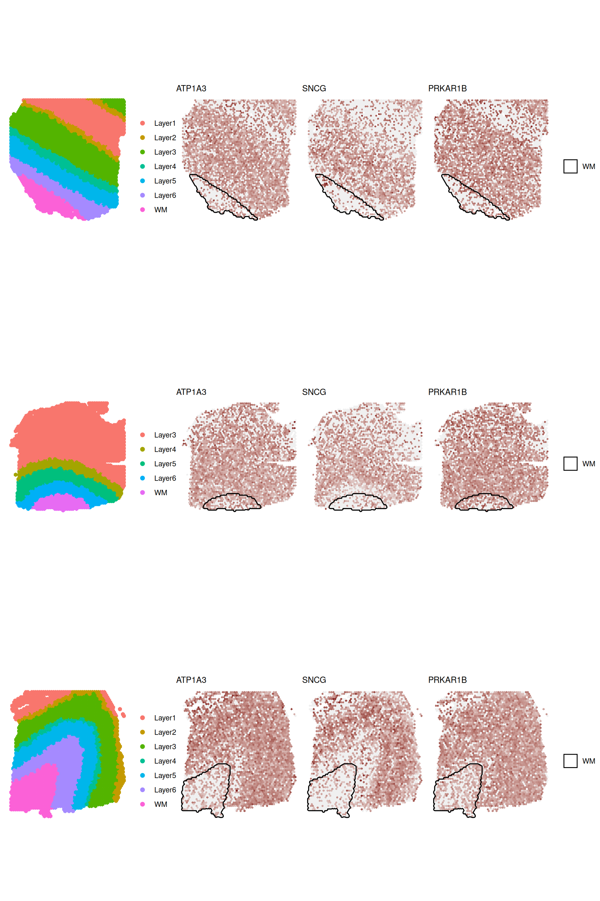

# A framework to discover Spatially Variable genes via spatial clusters

------------------------------------------------------------------------

## Introduction

*DESpace* is an intuitive framework for identifying spatially variable
(SV) genes (SVGs) via *edgeR* (Robinson, McCarthy, and Smyth 2010), one
of the most common methods for performing differential expression
analyses.

Based on pre-annotated spatial clusters as summarized spatial
information, *DESpace* models gene expression using a negative binomial
(NB), via *edgeR* (Robinson, McCarthy, and Smyth 2010), with spatial
clusters as covariates. SV genes (SVGs) are then identified by testing
the significance of spatial clusters.

Our approach assumes that the spatial structure can be summarized by
spatial clusters, which should reproduce the key features of the tissue
(e.g., white matter and layers in brain cortex). A significant test of
these covariates indicates that space influences gene expression, hence
identifying spatially variable genes.

Our model is flexible and robust, and is significantly faster than the
most SV methods. Furthermore, to the best of our knowledge, it is the
only SV approach that allows: - performing a SV test on each individual
spatial cluster, hence identifying the key regions affected by spatial
variability; - jointly fitting multiple samples, targeting genes with
consistent spatial patterns across biological replicates.

Below, we illustrate en example usage of the package.

## Basics

`DESpace` is implemented as a R package within Bioconductor, which is
the main venue for omics analyses, and we use various other Bioconductor
packages (e.g., SpatialLIBD, and edgeR).

`DESpace` package is available on Bioconductor and can be installed with
the following command:

``` r
if (!requireNamespace("BiocManager", quietly = TRUE)) {
    install.packages("BiocManager")
}

BiocManager::install("DESpace")

## Check that you have a valid Bioconductor installation
BiocManager::valid()
```

The development version of `DESpace`can also be installed from the
Bioconductor-devel branch or from GitHub.

To access the R code used in the vignettes, type:

``` r
browseVignettes("DESpace")
```

Questions relative to *DESpace* should be reported as a new issue at
[*BugReports*](https://github.com/peicai/DESpace/issues).

To cite *DESpace*, type:

``` r
citation("DESpace")
```

Load R packages:

``` r
suppressMessages({
    library(DESpace)
    library(ggplot2)
    library(ggforce)
    library(SpatialExperiment)
})
```

## Data

As an example dataset, we consider a human dorsolateral pre-frontal
cortex (DLPFC) spatial transcriptomics dataset from the 10x Genomics
Visium platform, including three neurotypical adult donors (i.e.,
biological replicates), with four images per subject (Maynard et al.
2020). The full dataset consists of 12 samples, which can be accessed
via
[*spatialLIBD*](https://bioconductor.org/packages/release/data/experiment/vignettes/spatialLIBD/inst/doc/spatialLIBD.html)
Bioconductor package.

### Input data

Here, we consider a subset of the original data, consisting of three
biological replicates: 1 image for each of the three brain subjects.
Initially, in Section 3 *individual sample* , we fit our approach on a
single sample, whose data is stored in `spe3` whereas all 3 samples will
later be jointly used in Section 4 *Multiple samples*.

``` r
# Connect to ExperimentHub
ehub <- ExperimentHub::ExperimentHub()
# Download the full real data (about 2.1 GB in RAM) use:
spe_all <- spatialLIBD::fetch_data(type = "spe", eh = ehub)
```

``` r
# Specify column names of spatial coordinates in colData(spe) 
coordinates <- c("array_row", "array_col")
# Specify column names of spatial clusters in colData(spe) 
cluster_col <- 'layer_guess_reordered'
# Remove spots missing annotations
spe_all <- spe_all[, !is.na(spe_all[[cluster_col]])]
# Create three spe objects, one per sample:
spe1 <- spe_all[, colData(spe_all)$sample_id == '151507']
spe2 <- spe_all[, colData(spe_all)$sample_id == '151669']
spe3 <- spe_all[, colData(spe_all)$sample_id == '151673']
rm(spe_all)
# Select small set of random genes for faster runtime in this example
set.seed(123)
sel_genes <- sample(dim(spe1)[1],2000)
spe1 <- spe1[sel_genes,]
spe2 <- spe2[sel_genes,]
spe3 <- spe3[sel_genes,]
# For covenience, we use “gene names” instead of “gene ids”:
rownames(spe1) <- rowData(spe1)$gene_name
rownames(spe2) <- rowData(spe2)$gene_name
rownames(spe3) <- rowData(spe3)$gene_name
```

The spatial tissues of each sample were manually annotated in the
original manuscript (Maynard et al. 2020), and spots were labeled into
one of the following categories: white matter (WM) and layers 1 to 6.
The manual annotations are stored in column `layer_guess_reordered` of
the `colData`, while columns `array_col` and `array_row` provide the
spatial coordinates of spots.

``` r
# We select a subset of columns
keep_col <- c(coordinates,cluster_col,"expr_chrM_ratio","cell_count")
head(colData(spe3)[keep_col])
```

    ## DataFrame with 6 rows and 5 columns
    ##                    array_row array_col layer_guess_reordered expr_chrM_ratio
    ##                    <integer> <integer>              <factor>       <numeric>
    ## AAACAAGTATCTCCCA-1        50       102                Layer3        0.166351
    ## AAACAATCTACTAGCA-1         3        43                Layer1        0.122376
    ## AAACACCAATAACTGC-1        59        19                WM            0.114089
    ## AAACAGAGCGACTCCT-1        14        94                Layer3        0.242223
    ## AAACAGCTTTCAGAAG-1        43         9                Layer5        0.152174
    ## AAACAGGGTCTATATT-1        47        13                Layer6        0.155095
    ##                    cell_count
    ##                     <integer>
    ## AAACAAGTATCTCCCA-1          6
    ## AAACAATCTACTAGCA-1         16
    ## AAACACCAATAACTGC-1          5
    ## AAACAGAGCGACTCCT-1          2
    ## AAACAGCTTTCAGAAG-1          4
    ## AAACAGGGTCTATATT-1          6

### Quality control/filtering

Quality control (QC) procedures at the spot and gene level aim to remove
both low-quality spots, and lowly abundant genes. For QC, we adhere to
the instructions from “Orchestrating Spatially Resolved Transcriptomics
Analysis with Bioconductor”
([*OSTA*](https://lmweber.org/OSTA-book/quality-control.html)). The
library size, UMI counts, ratio of mitochondrial chromosome (chM)
expression, and number of cells per spot are used to identify
low-quality spots.

``` r
# Sample 1:
# Calculate per-spot QC metrics and store in colData
spe1 <- scuttle::addPerCellQC(spe1,)
# Remove combined set of low-quality spots
spe1 <- spe1[, !(colData(spe1)$sum < 10 |             # library size
                colData(spe1)$detected < 10 |         # number of expressed genes
                colData(spe1)$expr_chrM_ratio > 0.30| # mitochondrial expression ratio
                colData(spe1)$cell_count > 10)]       # number of cells per spot
# Sample 2:
# Calculate per-spot QC metrics and store in colData
spe2 <- scuttle::addPerCellQC(spe2,)
# Remove combined set of low-quality spots
spe2 <- spe2[, !(colData(spe2)$sum < 20 |
                colData(spe2)$detected < 15 |
                colData(spe2)$expr_chrM_ratio > 0.35|
                colData(spe2)$cell_count > 8)]
# Sample 3:
spe3 <- scuttle::addPerCellQC(spe3,)
# Remove combined set of low-quality spots
spe3 <- spe3[, !(colData(spe3)$sum < 25 |
                colData(spe3)$detected < 25 |
                colData(spe3)$expr_chrM_ratio > 0.3|
                colData(spe3)$cell_count > 15)]
```

Then, we discard lowly abundant genes, which were detected in less than
20 spots.

``` r
# For each sample i:
for(i in seq_len(3)){
    spe_i <- eval(parse(text = paste0("spe", i)))
    # Select QC threshold for lowly expressed genes: at least 20 non-zero spots:
    qc_low_gene <- rowSums(assays(spe_i)$counts > 0) >= 20
    # Remove lowly abundant genes
    spe_i <- spe_i[qc_low_gene,]
    assign(paste0("spe", i), spe_i)
    message("Dimension of spe", i, ": ", dim(spe_i)[1], ", ", dim(spe_i)[2])
}
```

    ## Dimension of spe1: 847, 4169

    ## Dimension of spe2: 867, 3610

    ## Dimension of spe3: 907, 3584

## Individual sample

We fit our approach to discover SVGs in an individual sample. In Section
4 *Multiple samples*, we will show how to jointly embed multiple
replicates.

### Clustering

This framework relies on spatial clusters being accessible and
successfully summarizing the primary spatial characteristics of the
data. In most datasets, these spatial features are either accessible or
can be easily generated with spatial clustering algorithms.

#### Manual annotation

If manual annotations are provided (e.g., annotated by a pathologist),
we can directly use those. With the `spe` or `spe` object that contains
coordinates of the spot-level data, we can visualize spatial clusters.

``` r
# View LIBD layers for one sample
CD <- as.data.frame(colData(spe3))
ggplot(CD, 
    aes(x=array_col,y=array_row, 
    color=factor(layer_guess_reordered))) +
    geom_point() + 
    theme_void() + scale_y_reverse() + 
    theme(legend.position="bottom") + 
    labs(color = "", title = paste0("Manually annotated spatial clusters"))
```


#### Spatially resolved clustering

If manual annotations are not available, we can use spatially resolved
clustering tools. These methods, by jointly employing spatial
coordinates and gene expression data, enable obtaining spatial clusters.
Although, in this vignette we use pre-computed manually annotated
clusters, below we provide links to two popular spatially resolved
clustering tools: BayesSpace (Zhao et al. 2021) and StLearn (Pham et al.
2020).

##### BayesSpace

BayesSpace is a Bioconductor package that provides a Bayesian
statistical approach for spatial transcriptomics data clustering
([*BayesSpace*](https://edward130603.github.io/BayesSpace/index.html)).
There is a specific vignette for using BayesSpace on this dataset (human
DLPFC)
[*here*](https://edward130603.github.io/BayesSpace/articles/maynard_DLPFC.html).

After using BayesSpace, the spatial cluster assignments
(`spatial.cluster`) are available in the `colData(spe)`.

##### StLearn

StLearn, a python-based package, is designed for spatial transciptomics
data. It allows spatially-resolved clustering based on Louvain or
k-means
([*stLearn*](https://stlearn.readthedocs.io/en/latest/index.html)).
There is a tutorial for using StLearn on this dataset (human DLPFC)
[*here*](https://stlearn.readthedocs.io/en/latest/tutorials/stSME_clustering.html#Human-Brain-dorsolateral-prefrontal-cortex-(DLPFC)).

After running stLearn, we can store results as a `csv` file.

``` python
# Save spatial results
obsm.to_csv("stLearn_clusters.csv") 
```

Then, we can load these results in R and store spatial clusters in the
`spe` object.

``` r
stLearn_results <- read.csv("stLearn_clusters.csv", sep = ',', 
                            header = TRUE)
# Match colData(spe) and stLearn results
stLearn_results <- stLearn_results[match(rownames(colData(spe3)), 
                                    rownames(stLearn_results)), ]
colData(spe3)$stLearn_clusters <- stLearn_results$stLearn_pca_kmeans
```

### SV testing

Once we have spatial clusters, we can search for SVGs.

#### Gene-level test

Fit the model via `svg_test` function. Parameter `spe` specifies the
input `SpatialExperiment` or `SingleCellExperiment` object, while
`cluster_col` defines the column names of `colData(spe)` containing
spatial clusters. To obtain all statistics, set `verbose` to `TRUE`
(default value).

``` r
set.seed(123)
results <- svg_test(spe = spe3,
                        cluster_col = cluster_col, 
                        verbose = TRUE)
```

    ## using 'svg_test' for spatial gene/pattern detection.

    ## Filter low quality genes:

    ## min_counts = 20; min_non_zero_spots = 10.

    ## The number of genes that pass filtering is 907.

    ## single sample test

A list of results is returned. The main results of interest are stored
in the `gene_results`: a `data.fame`, where columns contain gene names
(`gene_id`), likelihood ratio test statistics (`LR`), average (across
spots) log-2 counts per million (`logCPM`), raw p-values (`PValue`) and
Benjamini-Hochberg adjusted p-values (`FDR`).

``` r
head(results$gene_results, 3)
```

    ##         gene_id       LR   logCPM        PValue           FDR
    ## SNCG       SNCG 1302.530 14.36227 3.069740e-278 2.784255e-275
    ## ATP1A3   ATP1A3 1235.844 14.68931 8.359666e-264 3.791108e-261
    ## PLEKHH1 PLEKHH1 1045.524 13.69919 1.272120e-222 3.846044e-220

The second element of the results (a `DGEList` object `estimated_y`)
contains the estimated common dispersion, which can later be used to
speed-up calculation when testing individual clusters.

The third and forth element of the results (`DGEGLM` and `DGELRT`
objects) contain full statistics from
[`edgeR::glmFit`](https://rdrr.io/pkg/edgeR/man/glmfit.html) and
[`edgeR::glmLRT`](https://rdrr.io/pkg/edgeR/man/glmLRT.html).

``` r
class(results$estimated_y); class(results$glmLrt); class(results$glmFit)
```

    ## [1] "DGEList"
    ## attr(,"package")
    ## [1] "edgeR"

    ## [1] "DGELRT"
    ## attr(,"package")
    ## [1] "edgeR"

    ## [1] "DGEGLM"
    ## attr(,"package")
    ## [1] "edgeR"

Visualize the gene expression of the three most significant genes in
[`FeaturePlot()`](https://peicai.github.io/DESpace/reference/FeaturePlot.md).
Note that the gene names in vector `feature`, should also appear in the
count matrix’s row names. Specifying the column names of spatial
coordinates of spots is only necessary when they are not named `row` and
`col`.

``` r
(feature <- results$gene_results$gene_id[seq_len(3)])
```

    ## [1] "SNCG"    "ATP1A3"  "PLEKHH1"

``` r
FeaturePlot(spe3, feature, 
            coordinates = coordinates, 
            ncol = 3, title = TRUE)
```


Additionally, function
[`FeaturePlot()`](https://peicai.github.io/DESpace/reference/FeaturePlot.md)
can draw an outline around each cluster.

``` r
FeaturePlot(spe3, feature, 
            coordinates = coordinates, 
            annotation_cluster = TRUE,
            cluster_col = cluster_col, 
            cluster = 'all', title = TRUE)
```


#### Individual cluster test

*DESpace* can also be used to reveal the specific areas of the tissue
affected by spatial variability; i.e., spatial clusters that are
particularly over/under abundant compared to the average. Function
[`individual_svg()`](https://peicai.github.io/DESpace/reference/individual_svg.md)
can be used to identify SVGs for each individual cluster. Parameter
`cluster_col` indicates the column names of `colData(spe)` containing
spatial clusters.

For every spatial cluster we test, `edgeR` would normally re-compute the
dispersion estimates based on the specific design of the test. However,
this calculation represents the majority of the overall computing time.
Therefore, to speed-up calculations, we propose to use the dispersion
estimates which were previously computed for the gene-level tests.
Albeit this is an approximation, in our benchmarks, it leads to
comparable performance in terms of sensitivity and specificity. If you
want to use pre-computed gene-level dispersion estimates, set `edgeR_y`
to `estimated_y`. Alternatively, if you want to re-compute dispersion
estimates (significantly slower, but marginally more accurate option),
leave `edgeR_y` empty.

``` r
set.seed(123)
cluster_results <- individual_svg(spe3, 
                                    edgeR_y = results$estimated_y,
                                    cluster_col = cluster_col)
```

    ## Filter low quality genes:

    ## min_counts = 20; min_non_zero_spots = 10.

    ## The number of genes that pass filtering is907.

    ## Pre-processing

    ## Start modeling

    ## Returning results

[`individual_svg()`](https://peicai.github.io/DESpace/reference/individual_svg.md)
returns a list containing the results of the individual cluster tests.
Similarly to above, for each cluster, results are reported as a
`data.fame`, where columns contain gene names (`gene_id`), likelihood
ratio test statistics (`LR`), log2-fold changes (`logFC`), raw p-values
(`PValue`) and Benjamini-Hochberg adjusted p-values (`FDR`). NB: that
the `logFC` compares each cluster to the rest of the tissue; e.g., a
logFC of 2 for WM test indicates that the average gene expression in WM
is (4 times) higher than the average gene expression in non-WM tissue.

Visualize results for WM.

``` r
class(cluster_results)
```

    ## [1] "list"

``` r
names(cluster_results)
```

    ## [1] "Layer1" "Layer2" "Layer3" "Layer4" "Layer5" "Layer6" "WM"

`top_results` function can be used to combine gene-and cluster-level
results. By default, results from
[`top_results()`](https://peicai.github.io/DESpace/reference/top_results.md)
report both adjusted p-values and log2-FC; however, users can also
choose to only report either, by specifying `select = "FDR"` or
`select = "logFC"`. Below, `gene_PValue` and `gene_FDR` columns refer to
the gene-level testing, while the subsequent columns indicate the
cluster-specific results.

``` r
merge_res <- top_results(results$gene_results, cluster_results)
head(merge_res,3)
```

    ##   gene_id  gene_LR gene_logCPM   gene_Pvalue      gene_FDR   Layer1_FDR
    ## 1    SNCG 1302.530    14.36227 3.069740e-278 2.784255e-275 4.643298e-13
    ## 2  ATP1A3 1235.844    14.68931 8.359666e-264 3.791108e-261 3.932084e-15
    ## 3 PLEKHH1 1045.524    13.69919 1.272120e-222 3.846044e-220 6.916994e-15
    ##     Layer2_FDR   Layer3_FDR   Layer4_FDR   Layer5_FDR   Layer6_FDR
    ## 1 2.808758e-06 8.458841e-80 7.609621e-13 2.924813e-26 1.929238e-65
    ## 2 2.024939e-03 5.098986e-60 6.777609e-12 1.448142e-15 7.997262e-25
    ## 3 1.210530e-06 6.447729e-44 1.058234e-06 4.481614e-17 3.190429e-01
    ##          WM_FDR Layer1_logFC Layer2_logFC Layer3_logFC Layer4_logFC
    ## 1 3.571838e-133   -0.7714249   -0.4604275    0.8320115    0.6135086
    ## 2 2.066457e-182   -0.6342199    0.2225215    0.5509819    0.4556480
    ## 3 7.857746e-209   -1.4032823   -0.7711668   -1.1047479   -0.8702769
    ##   Layer5_logFC Layer6_logFC  WM_logFC
    ## 1    0.5492233   -1.0925799 -1.966911
    ## 2    0.3252717   -0.4761104 -1.728962
    ## 3   -0.8053808   -0.1317911  2.320300

``` r
merge_res <- top_results(results$gene_results, cluster_results, 
                        select = "FDR")
head(merge_res,3)
```

    ##   gene_id  gene_LR gene_logCPM   gene_Pvalue      gene_FDR   Layer1_FDR
    ## 1    SNCG 1302.530    14.36227 3.069740e-278 2.784255e-275 4.643298e-13
    ## 2  ATP1A3 1235.844    14.68931 8.359666e-264 3.791108e-261 3.932084e-15
    ## 3 PLEKHH1 1045.524    13.69919 1.272120e-222 3.846044e-220 6.916994e-15
    ##     Layer2_FDR   Layer3_FDR   Layer4_FDR   Layer5_FDR   Layer6_FDR
    ## 1 2.808758e-06 8.458841e-80 7.609621e-13 2.924813e-26 1.929238e-65
    ## 2 2.024939e-03 5.098986e-60 6.777609e-12 1.448142e-15 7.997262e-25
    ## 3 1.210530e-06 6.447729e-44 1.058234e-06 4.481614e-17 3.190429e-01
    ##          WM_FDR
    ## 1 3.571838e-133
    ## 2 2.066457e-182
    ## 3 7.857746e-209

We can further specify a cluster and check top genes detected by
*DESpace*.

``` r
# Check top genes for WM
results_WM <- top_results(cluster_results = cluster_results, 
                        cluster = "WM")
head(results_WM, 3)
```

    ##         Cluster gene_id Cluster_LR Cluster_logCPM Cluster_logFC Cluster_PValue
    ## PLEKHH1      WM PLEKHH1   964.6524       13.69919      2.320300  8.663446e-212
    ## ATP1A3       WM  ATP1A3   841.7339       14.68931     -1.728962  4.556686e-185
    ## SLAIN1       WM  SLAIN1   723.0543       13.78576      1.870661  2.900809e-159
    ##           Cluster_FDR
    ## PLEKHH1 7.857746e-209
    ## ATP1A3  2.066457e-182
    ## SLAIN1  8.770113e-157

With `high_low` parameter, we can further filter genes to visualize
those with higher (`high_low = "high"`) or lower (`high_low = "low"`)
average abundance in the specified cluster, compared to the average
abundance in the rest of the tissue. By default, `high_low = “both”` and
all results are provided.

``` r
results_WM_both <- top_results(cluster_results = cluster_results, 
                                cluster = "WM", 
                                high_low = "both")
```

Here we present the highly abundant cluster SVGs; i.e., SVGs with higher
expression in WM compared to the rest of the area.

``` r
head(results_WM_both$high_genes, 3)
```

    ##         Cluster gene_id Cluster_LR Cluster_logCPM Cluster_logFC Cluster_PValue
    ## PLEKHH1      WM PLEKHH1   964.6524       13.69919      2.320300  8.663446e-212
    ## SLAIN1       WM  SLAIN1   723.0543       13.78576      1.870661  2.900809e-159
    ## CMTM5        WM   CMTM5   659.0630       13.65302      2.098509  2.388407e-145
    ##           Cluster_FDR
    ## PLEKHH1 7.857746e-209
    ## SLAIN1  8.770113e-157
    ## CMTM5   4.332571e-143

We visualize the lowly abundant cluster SVGs; i.e., SVGs with lower
expression in WM compared to the rest of the area.

``` r
head(results_WM_both$low_genes, 3)
```

    ##         Cluster gene_id Cluster_LR Cluster_logCPM Cluster_logFC Cluster_PValue
    ## ATP1A3       WM  ATP1A3   841.7339       14.68931     -1.728962  4.556686e-185
    ## PRKAR1B      WM PRKAR1B   669.2011       14.72797     -1.505987  1.490527e-147
    ## NSF          WM     NSF   628.9241       14.50629     -1.745008  8.566920e-139
    ##           Cluster_FDR
    ## ATP1A3  2.066457e-182
    ## PRKAR1B 3.379770e-145
    ## NSF     1.295033e-136

Visualize the gene expression of the top genes for layer WM. A cluster
outline can be drawn by specifying the column names of clusters stored
in `colData(spe)` and the vector of cluster names via `cluster_col` and
`cluster`.

``` r
# SVGs with higher than average abundance in WM
feature <- rownames(results_WM_both$high_genes)[seq_len(3)]
FeaturePlot(spe3, feature, cluster_col = cluster_col, 
            coordinates = coordinates, cluster = 'WM', 
            legend_cluster = TRUE, annotation_cluster = TRUE, 
            linewidth = 0.6, title = TRUE)
```


``` r
# SVGs with lower than average abundance in WM
feature <- rownames(results_WM_both$low_genes)[seq_len(3)]
FeaturePlot(spe3, feature, cluster_col = cluster_col, 
            coordinates = coordinates, cluster = 'WM', 
            legend_cluster = TRUE, annotation_cluster = TRUE, 
            linewidth = 0.6,title = TRUE)
```


## Multiple samples

If biological replicates are available, our framework allows jointly
modeling them to target SVGs with coherent spatial patterns across
samples. This approach may be particularly beneficial when data are
characterized by a large degree of (biological and technical)
variability, such as in cancer. Importantly, only genes detected (above
filtering thresholds) in all samples will be analyzed.

### Clustering

Similar to gene-level testing, the multi-sample extension requires
pre-annotated spatial clusters.

#### Manual annotation

If the manual annotation for each sample is available, we can combine
all samples and use manual annotations directly. Note that cluster
labels must be consistent across samples (i.e., WM in sample 1 should
represent the same tissue as WM in sample 2). With the `spe.combined`
object that contains coordinates of the spot-level data, we can
visualize spatial clusters.

``` r
set.seed(123)
# Use common genes
a <- rownames(counts(spe1)); 
b <- rownames(counts(spe2)); 
c <- rownames(counts(spe3))
# find vector of common genes across all samples:
CommonGene <- Reduce(intersect, list(a,b,c))
spe1 <- spe1[CommonGene,]
spe2 <- spe2[CommonGene,]
spe3 <- spe3[CommonGene,]

# Combine three samples
spe.combined <- cbind(spe1, spe2, spe3, deparse.level = 1)
ggplot(as.data.frame(colData(spe.combined)), 
    aes(x=array_col, y=array_row,
    color=factor(layer_guess_reordered))) +
    geom_point() + 
    facet_wrap(~sample_id) +
    theme_void() + scale_y_reverse() +
    theme(legend.position="bottom") + 
    labs(color = "", title = "Manually annotated spatial clusters")
```


#### Spatially resolved (multi-sample) clustering

Similarly to above, if manual annotations are not available, we can use
spatially resolved clustering tools. Both BayesSpace (Zhao et al. 2021)
and StLearn (Pham et al. 2020) allow jointly clustering multiple
samples. In particular each tool has a specific vignettes for
multi-testing clustering: [*BayesSpace
vignettes*](https://edward130603.github.io/BayesSpace/articles/joint_clustering.html),
and [*stLearn
vignettes*](https://stlearn.readthedocs.io/en/latest/tutorials/Integration_multiple_datasets.html).

##### Single sample clustering

In our benchmarks, we have noticed that, with both *BayesSpace* and
*StLearn*, joint spatial clustering of multiple samples is more prone to
failure and inaccurate results than spatial clustering of individual
samples. Therefore, if multi-sample clustering fails, we suggest trying
to cluster individual samples (as in Section 3 *Individual sample*) and
manually match cluster ids across samples, to ensure that “cluster 1”
always refers to the same spatial region in all samples.

### SV testing

Once we have spatial clusters for multiple samples, we add them to
`colData(spe.combined)` as the column `layer_guess_reordered` and fit
the model with spatial clusters as covariates.

#### Gene-level test

Fit the model via
[`svg_test()`](https://peicai.github.io/DESpace/reference/svg_test.md).
Parameter `spe` specifies the input `SpatialExperiment` or
`SingleCellExperiment` object, while `cluster_col` and `sample_col`
define the column names of `colData(spe)` containing spatial clusters
and sample ids. With `replicates = TRUE`, we fit the multi-sample model.

The second element of the result (a `DGEList` object
`estimated_y_multi`) contains the estimated common dispersion for the
multi-sample case.

``` r
set.seed(123)
multi_results <- svg_test(spe = spe.combined,
                                cluster_col = cluster_col,
                                sample_col = 'sample_id',
                                replicates = TRUE)
```

    ## using 'svg_test' for spatial gene/pattern detection.

    ## Filter low quality genes:

    ## min_counts = 20; min_non_zero_spots = 10.

    ## The number of genes that pass filtering is 827.

    ## multi-sample test

    ## Repeated column names found in count matrix

A list of results are returned. The main results of interest are stored
in the `gene_results`.

``` r
head(multi_results$gene_results,3)
```

    ##        gene_id       LR   logCPM PValue FDR
    ## HPCAL1  HPCAL1 2063.951 14.41886      0   0
    ## NSF        NSF 1524.989 14.70448      0   0
    ## ATP1A3  ATP1A3 1578.196 14.88558      0   0

The second element of the results (a `DGEList` object `estimated_y`)
contains the estimated common dispersion, which can later be used to
speed-up calculation when testing individual clusters.

``` r
class(multi_results$estimated_y)
```

    ## [1] "DGEList"
    ## attr(,"package")
    ## [1] "edgeR"

For each sample, we can visualize the gene expression of the most
significant SVGs. Note that column names of spatial coordinates of spots
should be `row` and `col`.

``` r
## Top three spatially variable genes
feature <- multi_results$gene_results$gene_id[seq_len(3)]; feature
```

    ## [1] "HPCAL1" "NSF"    "ATP1A3"

``` r
## Sample names
samples <- unique(colData(spe.combined)$sample_id); samples
```

    ## [1] "151507" "151669" "151673"

``` r
## Use purrr::map to combine multiple figures
spot_plots <- purrr::map(seq_along(samples), function(j) {
    ## Subset spe for each sample j
    spe_j <- spe.combined[, colData(spe.combined)$sample_id == samples[j] ]
    ## Store three gene expression plots with gene names in `feature` for spe_j
    spot_plots <- FeaturePlot(spe_j, feature, 
                            coordinates = coordinates,
                            cluster_col = cluster_col, title = TRUE,
                            annotation_cluster = TRUE, legend_cluster = TRUE)
    return(spot_plots)
})
patchwork::wrap_plots(spot_plots, ncol=1)
```


#### Individual cluster test

Similarly to what shown in Section 3 *Individual sample*, our framework
can discover the key SV spatial clusters also when jointly fitting
multiple samples. For a multi-sample testing, set `replicates = TRUE` in
[`individual_svg()`](https://peicai.github.io/DESpace/reference/individual_svg.md).

``` r
set.seed(123)
cluster_results <- individual_svg(spe.combined, 
                                edgeR_y = multi_results$estimated_y,
                                replicates = TRUE, 
                                cluster_col = cluster_col)
```

    ## Filter low quality genes:

    ## min_counts = 20; min_non_zero_spots = 10.

    ## The number of genes that pass filtering is827.

    ## Pre-processing

    ## Start modeling

    ## Returning results

[`individual_svg()`](https://peicai.github.io/DESpace/reference/individual_svg.md)
returns a list containing the results of individual clusters, specified
in `cluster` parameter. In this case, logFC refers to the log2-FC
between the average abundance, across all samples, of a spatial cluster
and the average abundance of all remaining clusters (e.g., WM vs. non-WM
tissue).

Visualize results for WM.

``` r
class(cluster_results)
```

    ## [1] "list"

``` r
names(cluster_results)
```

    ## [1] "Layer1" "Layer2" "Layer3" "Layer4" "Layer5" "Layer6" "WM"

As above, `top_results` function can be used to combine gene-level and
cluster-level results.

``` r
merge_res <- top_results(multi_results$gene_results, cluster_results, 
                        select = "FDR")
head(merge_res,3)
```

    ##   gene_id  gene_LR gene_logCPM gene_Pvalue gene_FDR    Layer1_FDR    Layer2_FDR
    ## 1  ATP1A3 1578.196    14.88558           0        0  1.984383e-93  2.062544e-02
    ## 2  HPCAL1 2063.951    14.41886           0        0  4.528139e-15 1.888747e-191
    ## 3     NSF 1524.989    14.70448           0        0 5.199695e-127  4.090085e-01
    ##      Layer3_FDR   Layer4_FDR    Layer5_FDR   Layer6_FDR        WM_FDR
    ## 1  3.677009e-16 1.916312e-23  1.722978e-46 4.968132e-03 8.769877e-194
    ## 2 4.842541e-126 7.539843e-51 1.024299e-117 3.514907e-15  8.846709e-39
    ## 3  4.327942e-01 1.896550e-24  3.643074e-60 1.000256e-01 3.073861e-147

We can further select a cluster of interest, and check the top genes
detected in that cluster.

``` r
# Check top genes for WM
results_WM <- top_results(cluster_results = cluster_results, 
                        cluster = "WM")
# For each gene, adjusted p-values for each cluster
head(results_WM,3)
```

    ##         Cluster gene_id Cluster_LR Cluster_logCPM Cluster_logFC Cluster_PValue
    ## PLEKHH1      WM PLEKHH1   933.0257       14.00544      1.725113  6.494982e-205
    ## ATP1A3       WM  ATP1A3   893.8603       14.88558     -1.285887  2.120889e-196
    ## SNCG         WM    SNCG   770.7869       14.60584     -1.597403  1.212461e-169
    ##           Cluster_FDR
    ## PLEKHH1 5.371350e-202
    ## ATP1A3  8.769877e-194
    ## SNCG    3.342351e-167

With `high_low = "both"`, we can further filter genes to visualize
highly and lowly abundant SVGs.

``` r
results_WM_both <- top_results(cluster_results = cluster_results, 
                            cluster = "WM", high_low = "both")
```

Here we present the highly abundant cluster SVGs; i.e., SVGs with higher
expression in WM compared to the rest of the tissue.

``` r
head(results_WM_both$high_genes,3)
```

    ##         Cluster gene_id Cluster_LR Cluster_logCPM Cluster_logFC Cluster_PValue
    ## PLEKHH1      WM PLEKHH1   933.0257       14.00544      1.725113  6.494982e-205
    ## SLAIN1       WM  SLAIN1   660.4551       14.07042      1.407398  1.189483e-145
    ## CMTM5        WM   CMTM5   617.2549       13.99119      1.479961  2.956671e-136
    ##           Cluster_FDR
    ## PLEKHH1 5.371350e-202
    ## SLAIN1  1.639503e-143
    ## CMTM5   3.493095e-134

We visualize the lowly abundant cluster SVGs; i.e., SVGs with lower
expression in WM compared to the rest of the tissue.

``` r
head(results_WM_both$low_genes,3)
```

    ##         Cluster gene_id Cluster_LR Cluster_logCPM Cluster_logFC Cluster_PValue
    ## ATP1A3       WM  ATP1A3   893.8603       14.88558     -1.285887  2.120889e-196
    ## SNCG         WM    SNCG   770.7869       14.60584     -1.597403  1.212461e-169
    ## PRKAR1B      WM PRKAR1B   703.9767       14.89242     -1.135692  4.082649e-155
    ##           Cluster_FDR
    ## ATP1A3  8.769877e-194
    ## SNCG    3.342351e-167
    ## PRKAR1B 8.440878e-153

Visualize the gene expression of top three genes for layer WM.

``` r
# SVGs with higher abundance in WM, than in non-WM tissue
feature_high <- rownames(results_WM_both$high_genes)[seq_len(3)]
# SVGs with lower abundance in WM, than in non-WM tissue
feature_low <- rownames(results_WM_both$low_genes)[seq_len(3)]
plot_list_high <- list(); plot_list_low <- list()
## Sample names
samples <- unique(colData(spe.combined)$sample_id)
for(j in seq_along(samples)){
    ## Subset spe for each sample j
    spe_j <- spe.combined[, colData(spe.combined)$sample_id == samples[j]]
    ## Gene expression plots with top highly abundant cluster SVGs for spe_j
    plot_list_high[[j]] <- FeaturePlot(spe_j, feature_high, 
                                coordinates = coordinates,
                                cluster_col = cluster_col, 
                                linewidth = 0.6,
                                cluster = 'WM', annotation_cluster = TRUE,
                                legend_cluster = TRUE, title = TRUE)
    ## Gene expression plots with top lowly abundant cluster SVGs for spe_j
    plot_list_low[[j]] <- FeaturePlot(spe_j, feature_low, 
                                coordinates = coordinates,
                                cluster_col = cluster_col, 
                                linewidth = 0.6,
                                cluster = 'WM', annotation_cluster = TRUE,
                                legend_cluster = TRUE, title = TRUE)
}
# Expression plots for SVGs with higher abundance in WM, than in non-WM tissue
patchwork::wrap_plots(plot_list_high, ncol=1)
```


``` r
# Expression plots for SVGs with lower abundance in WM, than in non-WM tissue
patchwork::wrap_plots(plot_list_low, ncol=1)
```



#### Sample-specific covariates (e.g., batch effects)

If sample-specific covariates, such as batch effects, are available, we
can account for them in *DESpace*. The adjustment works as in the
*edgeR* original framework: the mean of the negative binomial model is
expressed as a function of spatial clusters, and additional nuisance
covariates; differential testing is then performed on spatial clusters
only, to identify SVGs. Note that sample-specific covariates can be used
instead of samples, but a joint modelling of both samples and
(sample-specific) covariates is not possible because the two variables
are nested.

To show an example application, we artificially separate samples in 2
batches:

``` r
spe.combined$batch_id = ifelse(spe.combined$sample_id == "151507", "batch_1", "batch_2")

table(spe.combined$batch_id, spe.combined$sample_id)
```

    ##          
    ##           151507 151669 151673
    ##   batch_1   4169      0      0
    ##   batch_2      0   3610   3584

Analyses are performed, as explained above, in Section 5; yet, when
running `svg_test`, we set the `sample_col` to `batch_id`:

``` r
set.seed(123)
batch_results <- svg_test(spe = spe.combined,
                                cluster_col = cluster_col,
                                sample_col = 'batch_id',
                                replicates = TRUE)
```

## Session info

``` r
sessionInfo()
```

    ## R version 4.5.2 Patched (2025-11-24 r89071)
    ## Platform: x86_64-pc-linux-gnu
    ## Running under: Ubuntu 24.04.3 LTS
    ## 
    ## Matrix products: default
    ## BLAS:   /usr/lib/x86_64-linux-gnu/openblas-pthread/libblas.so.3 
    ## LAPACK: /usr/lib/x86_64-linux-gnu/openblas-pthread/libopenblasp-r0.3.26.so;  LAPACK version 3.12.0
    ## 
    ## locale:
    ##  [1] LC_CTYPE=C.UTF-8       LC_NUMERIC=C           LC_TIME=C.UTF-8       
    ##  [4] LC_COLLATE=C.UTF-8     LC_MONETARY=C.UTF-8    LC_MESSAGES=C.UTF-8   
    ##  [7] LC_PAPER=C.UTF-8       LC_NAME=C              LC_ADDRESS=C          
    ## [10] LC_TELEPHONE=C         LC_MEASUREMENT=C.UTF-8 LC_IDENTIFICATION=C   
    ## 
    ## time zone: UTC
    ## tzcode source: system (glibc)
    ## 
    ## attached base packages:
    ## [1] stats4    stats     graphics  grDevices utils     datasets  methods  
    ## [8] base     
    ## 
    ## other attached packages:
    ##  [1] SpatialExperiment_1.20.0    SingleCellExperiment_1.32.0
    ##  [3] SummarizedExperiment_1.40.0 Biobase_2.70.0             
    ##  [5] GenomicRanges_1.62.0        Seqinfo_1.0.0              
    ##  [7] IRanges_2.44.0              S4Vectors_0.48.0           
    ##  [9] BiocGenerics_0.56.0         generics_0.1.4             
    ## [11] MatrixGenerics_1.22.0       matrixStats_1.5.0          
    ## [13] ggforce_0.5.0               ggplot2_4.0.1              
    ## [15] DESpace_2.3.2               BiocStyle_2.38.0           
    ## 
    ## loaded via a namespace (and not attached):
    ##   [1] later_1.4.4              BiocIO_1.20.0            bitops_1.0-9            
    ##   [4] filelock_1.0.3           tibble_3.3.0             polyclip_1.10-7         
    ##   [7] XML_3.99-0.20            lifecycle_1.0.4          httr2_1.2.1             
    ##  [10] sf_1.0-22                edgeR_4.8.0              doParallel_1.0.17       
    ##  [13] lattice_0.22-7           MASS_7.3-65              magrittr_2.0.4          
    ##  [16] limma_3.66.0             plotly_4.11.0            sass_0.4.10             
    ##  [19] rmarkdown_2.30           jquerylib_0.1.4          yaml_2.3.10             
    ##  [22] httpuv_1.6.16            otel_0.2.0               sessioninfo_1.2.3       
    ##  [25] spatstat.sparse_3.1-0    cowplot_1.2.0            DBI_1.2.3               
    ##  [28] RColorBrewer_1.1-3       golem_0.5.1              abind_1.4-8             
    ##  [31] purrr_1.2.0              RCurl_1.98-1.17          tweenr_2.0.3            
    ##  [34] rappdirs_0.3.3           circlize_0.4.16          ggrepel_0.9.6           
    ##  [37] irlba_2.3.5.1            spatstat.utils_3.2-0     terra_1.8-80            
    ##  [40] units_1.0-0              goftest_1.2-3            spatstat.random_3.4-3   
    ##  [43] pkgdown_2.2.0            codetools_0.2-20         DelayedArray_0.36.0     
    ##  [46] DT_0.34.0                scuttle_1.20.0           tidyselect_1.2.1        
    ##  [49] shape_1.4.6.1            farver_2.1.2             viridis_0.6.5           
    ##  [52] ScaledMatrix_1.18.0      shinyWidgets_0.9.0       BiocFileCache_3.0.0     
    ##  [55] spatstat.explore_3.6-0   GenomicAlignments_1.46.0 jsonlite_2.0.0          
    ##  [58] BiocNeighbors_2.4.0      GetoptLong_1.0.5         e1071_1.7-16            
    ##  [61] scater_1.38.0            iterators_1.0.14         systemfonts_1.3.1       
    ##  [64] foreach_1.5.2            tools_4.5.2              ggnewscale_0.5.2        
    ##  [67] ragg_1.5.0               Rcpp_1.1.0               glue_1.8.0              
    ##  [70] gridExtra_2.3            SparseArray_1.10.3       xfun_0.54               
    ##  [73] dplyr_1.1.4              withr_3.0.2              BiocManager_1.30.27     
    ##  [76] fastmap_1.2.0            rsvd_1.0.5               digest_0.6.39           
    ##  [79] R6_2.6.1                 mime_0.13                textshaping_1.0.4       
    ##  [82] colorspace_2.1-2         tensor_1.5.1             spatstat.data_3.1-9     
    ##  [85] RSQLite_2.4.4            cigarillo_1.0.0          config_0.3.2            
    ##  [88] tidyr_1.3.1              data.table_1.17.8        rtracklayer_1.70.0      
    ##  [91] class_7.3-23             httr_1.4.7               htmlwidgets_1.6.4       
    ##  [94] S4Arrays_1.10.0          pkgconfig_2.0.3          gtable_0.3.6            
    ##  [97] blob_1.2.4               ComplexHeatmap_2.26.0    S7_0.2.1                
    ## [100] XVector_0.50.0           htmltools_0.5.8.1        bookdown_0.45           
    ## [103] clue_0.3-66              scales_1.4.0             attempt_0.3.1           
    ## [106] png_0.1-8                spatstat.univar_3.1-5    knitr_1.50              
    ## [109] rjson_0.2.23             nlme_3.1-168             curl_7.0.0              
    ## [112] proxy_0.4-27             cachem_1.1.0             GlobalOptions_0.1.2     
    ## [115] stringr_1.6.0            BiocVersion_3.22.0       KernSmooth_2.23-26      
    ## [118] vipor_0.4.7              parallel_4.5.2           AnnotationDbi_1.72.0    
    ## [121] restfulr_0.0.16          desc_1.4.3               pillar_1.11.1           
    ## [124] grid_4.5.2               vctrs_0.6.5              promises_1.5.0          
    ## [127] BiocSingular_1.26.1      dbplyr_2.5.1             beachmat_2.26.0         
    ## [130] xtable_1.8-4             cluster_2.1.8.1          beeswarm_0.4.0          
    ## [133] paletteer_1.6.0          evaluate_1.0.5           magick_2.9.0            
    ## [136] Rsamtools_2.26.0         cli_3.6.5                locfit_1.5-9.12         
    ## [139] compiler_4.5.2           rlang_1.1.6              crayon_1.5.3            
    ## [142] labeling_0.4.3           classInt_0.4-11          rematch2_2.1.2          
    ## [145] ggbeeswarm_0.7.2         fs_1.6.6                 stringi_1.8.7           
    ## [148] viridisLite_0.4.2        deldir_2.0-4             BiocParallel_1.44.0     
    ## [151] assertthat_0.2.1         Biostrings_2.78.0        lazyeval_0.2.2          
    ## [154] spatstat.geom_3.6-1      Matrix_1.7-4             ExperimentHub_3.0.0     
    ## [157] benchmarkme_1.0.8        patchwork_1.3.2          bit64_4.6.0-1           
    ## [160] KEGGREST_1.50.0          statmod_1.5.1            shiny_1.11.1            
    ## [163] AnnotationHub_4.0.0      memoise_2.0.1            bslib_0.9.0             
    ## [166] benchmarkmeData_1.0.4    bit_4.6.0                spatialLIBD_1.22.0

## References

Maynard, Kristen R, Leonardo Collado-Torres, Lukas M Weber, Cedric
Uytingco, Brianna K Barry, Stephen R Williams, Joseph L Catallini, et
al. 2020. “Transcriptome-Scale Spatial Gene Expression in the Human
Dorsolateral Prefrontal Cortex.” *BioRxiv*, 2020–02.
<https://doi.org/10.1038/s41593-020-00787-0>.

Pham, Duy, Xiao Tan, Jun Xu, Laura F Grice, Pui Yeng Lam, Arti Raghubar,
Jana Vukovic, Marc J Ruitenberg, and Quan Nguyen. 2020. “StLearn:
Integrating Spatial Location, Tissue Morphology and Gene Expression to
Find Cell Types, Cell-Cell Interactions and Spatial Trajectories Within
Undissociated Tissues.” *Biorxiv*, 2020–05.
<https://doi.org/doi:10.1093/bioinformatics/btz914>.

Robinson, Mark D, Davis J McCarthy, and Gordon K Smyth. 2010. “edgeR: A
Bioconductor Package for Differential Expression Analysis of Digital
Gene Expression Data.” *Bioinformatics* 26 (1): 139–40.
<https://doi.org/10.1093/bioinformatics/btp616>.

Zhao, Edward, Matthew R Stone, Xing Ren, Jamie Guenthoer, Kimberly S
Smythe, Thomas Pulliam, Stephen R Williams, et al. 2021. “Spatial
Transcriptomics at Subspot Resolution with BayesSpace.” *Nature
Biotechnology* 39 (11): 1375–84.
<https://doi.org/10.1038/s41587-021-00935-2>.
